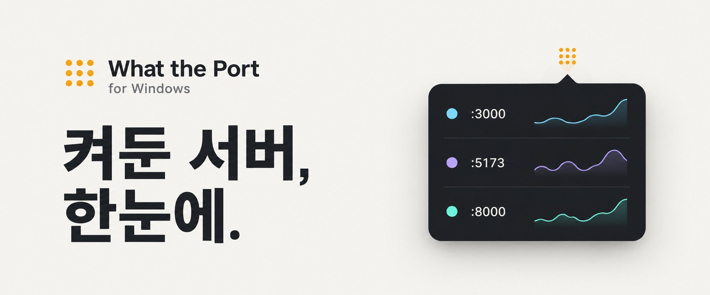
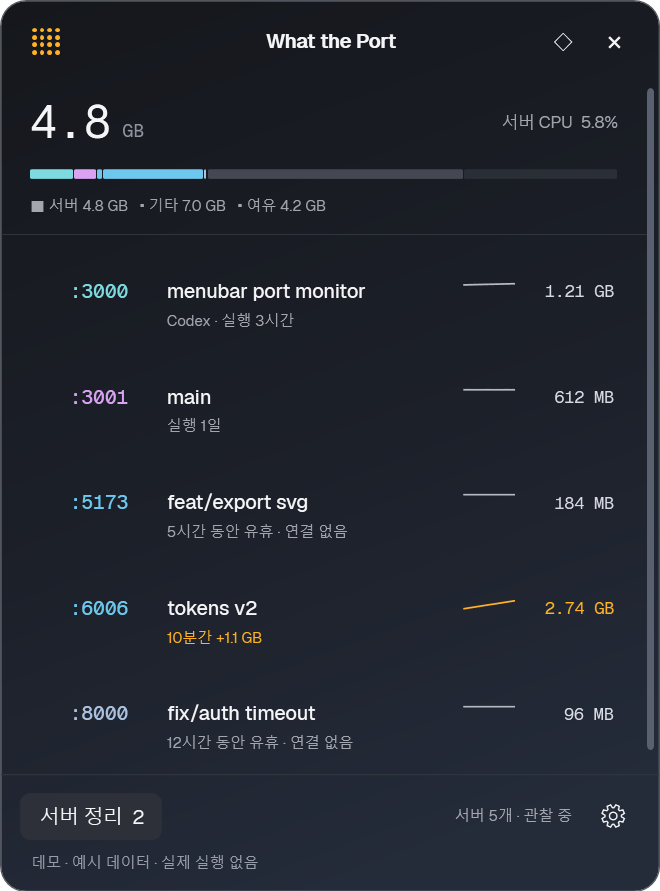
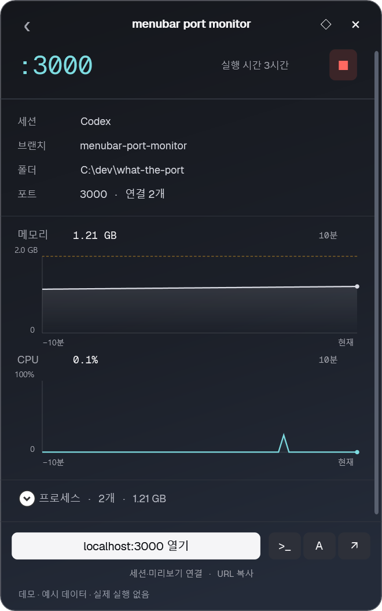
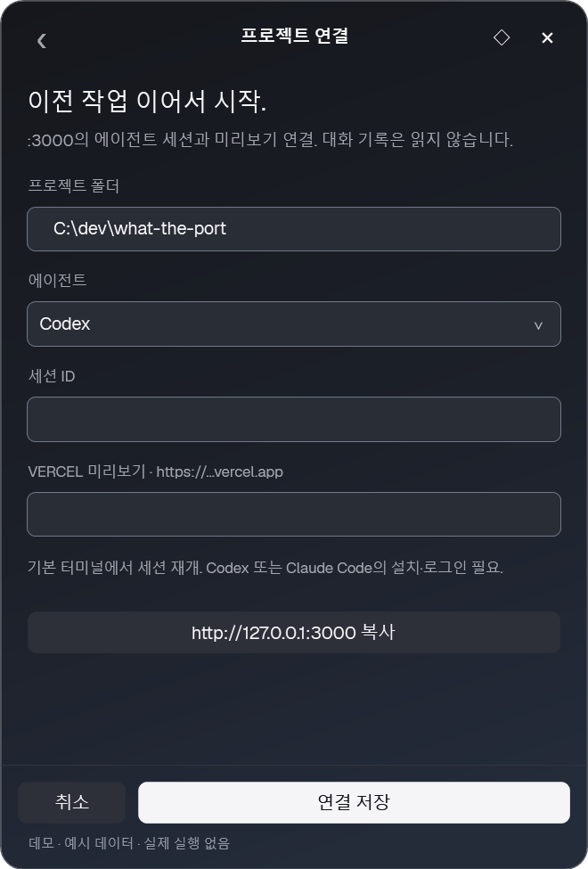
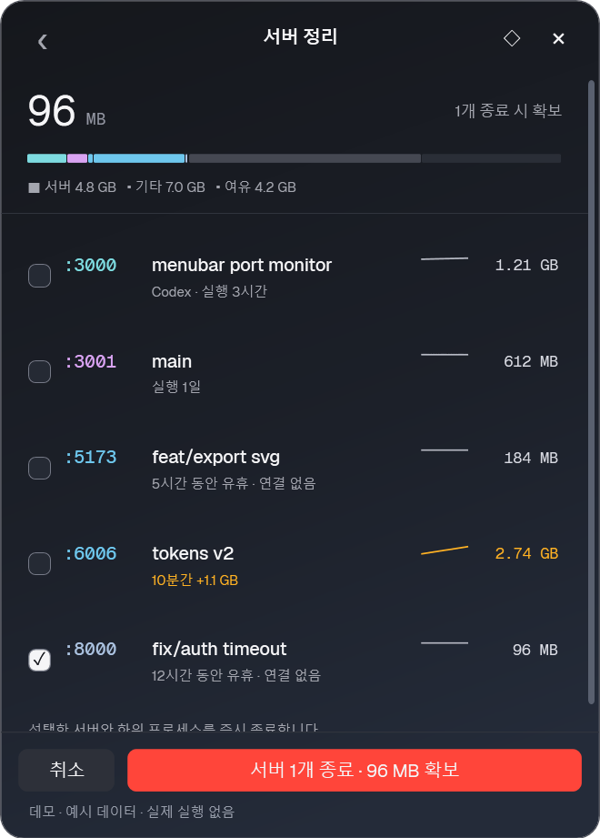
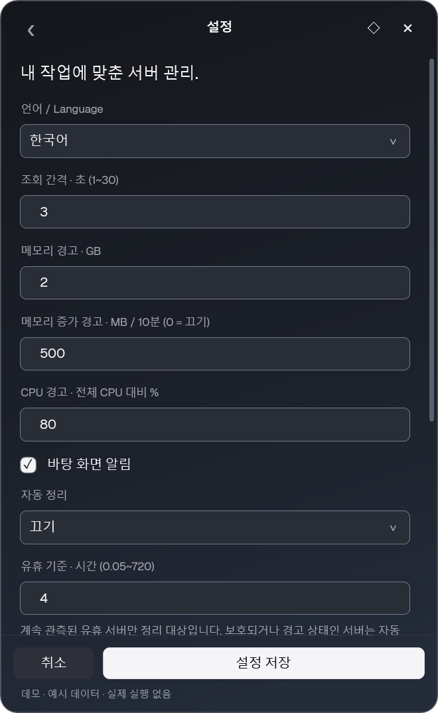

# What the Port for Windows

**Windows 트레이에서 한눈에 확인하는 로컬 개발 서버.**

프로젝트, 포트, Git 브랜치, 실행 시간, 메모리·CPU 확인부터 잊고 있던 서버 정리까지.

[소개·다운로드 페이지](https://seoheejung.github.io/what-the-port-win/) · [시작하기](#시작하기) · [사용법](docs/usage.md) · [직접 확인할 항목](docs/checklist.md) · [접근성 검수](docs/accessibility-audit.md) · [보안 검수](docs/security-audit.md) · [소스 빌드](#빌드)

무료 · 오픈 소스 · Windows 10/11 x64 · .NET Framework 4.8 · 계정 불필요



*다운로드 페이지의 밝은 톤에 맞춘 소개용 생성 이미지. 아래 앱 화면은 최신 Windows 빌드의 실제 데모 캡처.*

## 실행 중인 서버 한눈에 확인

작은 점 격자 아이콘으로 상주하는 WPF 트레이 앱. **Ctrl+Alt+P**로 서버 목록을 표시·숨김. 열려 있을 때 누르면 트레이로 숨고, 다시 누르면 나타난다. 숨겨도 서버 감시는 계속된다. 포트별 고정 색상, 프로젝트·브랜치·가동 시간, 메모리 사용량과 추이 표시.

제목 드래그로 위치 변경·자동 저장, 숨김·재실행 후 같은 위치 복원. 화면 전환 시 하단 유지 및 위쪽 확장. 작업 영역 안에서 높이 제한·본문 스크롤. 설정 → 창 위치 초기화으로 주 모니터 위치 초기화.

<p align="center">
  
</p>

### 작업 중이던 프로젝트로 복귀

프로젝트 폴더·Git 브랜치·연관 에이전트 확인. 로컬 URL 열기, PowerShell 또는 Windows Terminal 실행, **직접 등록한** Codex·Claude Code 세션 재개와 Vercel 미리보기 연결.

서버 상세의 **세션·미리보기 연결 · URL 복사**를 누르면 **프로젝트 연결** 화면이 열린다. 필요한 항목을 입력하고 **연결 저장**을 누른다.

| 입력란·버튼 | 사용법 |
|---|---|
| 프로젝트 폴더 | 감지된 서버 폴더. 기존의 절대 경로여야 하며 감지된 폴더와 일치해야 함 |
| 에이전트 | 재개할 세션에 맞춰 Codex 또는 Claude Code 선택 |
| 세션 ID | 해당 CLI에서 재개 가능한 실제 세션 ID를 직접 입력. 세션 재개를 사용하지 않으면 빈칸 유지 |
| Vercel 미리보기 | 이미 있는 `https://프로젝트.vercel.app` 주소 입력. 사용하지 않으면 빈칸 유지 |
| `http://127.0.0.1:포트 복사` | 로컬 서버 주소를 클립보드에 복사. 연결 설정 저장과 별개 |
| 연결 저장 / 취소 | 폴더·포트별로 연결 저장 / 저장 없이 상세로 복귀 |

상세 화면의 **`>_`**는 프로젝트 폴더에서 터미널을 열고, **A**는 등록한 세션을 재개하며, **↗**는 등록한 Vercel 주소를 브라우저로 연다. A 또는 ↗에 필요한 값이 없으면 프로젝트 연결 화면에서 등록을 안내한다. 노란색 “Vercel 미리보기 URL을 등록해 주세요”는 이 안내이며, Vercel 사용은 선택 사항이다. 앱이 Vercel에 배포하거나 주소를 자동으로 찾지는 않는다.

세션 재개는 선택한 에이전트 CLI의 설치·로그인이 필요하다. 대화 기록은 읽지 않으며, 상세의 에이전트 이름만으로 세션 연결이 완료된 것은 아니다. wmux 등의 내부 통신 포트에는 개발 프로젝트나 Vercel 주소가 없을 수 있으므로 연결 정보를 비워 두어도 된다. [연결 기준과 CLI 등록 방법](docs/usage.md#프로젝트와-세션-연결).

<p align="center">
  
  
</p>

### 자원 증가와 이상 징후 확인

- **메모리 경고** — 기본 2 GB 초과
- **증가량 경고** — 10분 동안 기본 500 MB 증가
- **CPU 경고** — 전체 논리 코어 대비 기본 80% 이상, 연속 3회 관측
- **사용량 추이** — 서버 소유 프로세스 트리 기준, 최근 10분 차트와 목록 스파크라인
- **알림** — 트레이 경고색, Windows 알림, 1시간 일시 중지

### 잊고 있던 서버 정리

**서버 정리 (Clean up)**에서 idle 후보 확인, 종료 대상 선택, 예상 회수 메모리 확인 후 일괄 종료. 데이터베이스·시스템·셸·터미널·에이전트 보호 및 다른 리스너의 하위 트리 제외.

자동 정리 **Off / Ask / Automatic**. 기본 **Off**, 기본 idle 기준 **4시간**. 연속 관측된 비활성 서버만 대상, 보호·경고 서버 제외.

<p align="center">
  
  
</p>

*고정 샘플 데이터 기반 캡처. 데모 모드의 실제 프로세스 종료·외부 실행·사용자 설정 저장 없음.*

## 시작하기

1. 프로젝트 폴더의 **`launch.cmd` 실행** — 빌드 결과가 없으면 최초 로컬 빌드
2. 개발 서버 실행 후 트레이의 점 격자 아이콘 클릭 또는 **Ctrl+Alt+P**
3. 서버 행 클릭으로 상세 확인, **서버 정리 (Clean up)**으로 정리 대상 선택

**요구 환경:** Windows 10/11 x64, .NET Framework 4.8. 관리자 권한·.NET SDK·NuGet·npm 패키지 설치 불필요.

**다운로드한 ZIP은 모두 압축을 푼 뒤 `WhatThePort.exe`를 실행하세요.** `wtp.exe`는 터미널용 도구이며, 인수 없이 실행하면 본체를 열고 종료합니다. DLL·설정·폰트는 본체와 함께 유지합니다. 배포 파일별 용도는 [포터블 안내문](assets/portable-README.md)에 있습니다.

| 실행 방식 | 방법 |
|---|---|
| 바로 실행 | `launch.cmd` 또는 `dist\WhatThePort.exe` |
| 포터블 | `dist` 폴더 전체 또는 로컬 패키지 ZIP 압축 해제 |
| 시작 메뉴 설치 | `powershell -NoProfile -ExecutionPolicy Bypass -File scripts/install.ps1` |
| 로그인 자동 시작 | 설치 명령 끝에 `-StartWithWindows` 추가 |

> **서버가 보이지 않는 경우:** 개발 런타임만 표시하는 기본 필터 확인. 사용자 정의 실행 파일은 **Show all user listeners** 또는 Settings → **Show all user TCP listeners**로 표시. 이 경우 wmux·에이전트 등 일반 앱의 내부 리스너도 포함되므로, 표시된 포트 전체가 웹 개발 서버를 의미하지는 않음.

## 주요 기능

| 기능 | Windows 구현 |
|---|---|
| 서버 탐지 | 동일 사용자·로그인 세션의 IPv4/IPv6 TCP 리스너 |
| 개발 런타임 | Node, Bun, Deno, Python, Java, .NET, PHP 등 |
| 프로젝트 정보 | 포트, 폴더, Git 브랜치, 실행 시간, 연결 수 |
| 자원 측정 | 서버와 소유 하위 프로세스의 working set·CPU |
| 추이·경고 | 최근 10분 차트, 메모리·증가량·CPU 임계값 |
| 종료·정리 | 개별·일괄 종료, PID·생성 시각·사용자·세션 재확인 |
| 작업 복귀 | 로컬 URL, 터미널, 등록된 에이전트 세션·Vercel 링크 |
| 언어 | 기본 한국어, 선택 즉시 미리보기·저장 시 확정·취소 시 복원 |
| CLI | 서버 목록, JSON 출력, 프로젝트 링크 등록 |
| 트레이 조작 | 전역 단축키, 핀 고정, 키보드 탐색 |
| 로컬 실행 | 오프라인 빌드, 설정 저장, 데모, 포터블 패키지 |

## 사용법

| 조작 | 동작 |
|---|---|
| 트레이 클릭 / Ctrl+Alt+P | 패널 표시·숨김 |
| 서버 행 클릭 / Enter | 서버 상세 |
| Clean up / C | 정리 대상 선택 |
| 톱니바퀴 / Ctrl+, | 설정 |
| ◇ / ◆ | 포커스 이동 시 패널 유지 설정·해제 |
| × | 트레이로 숨김 |
| 트레이 우클릭 → Quit | 앱 종료 |
| Esc | 목록 복귀 / 패널 숨김 |

상세 화면 단축키: **O** 로컬 URL · **T** 터미널 · **A** 등록 세션 · **V** 등록 미리보기.

하단의 **Ctrl+Alt+P 창 표시/숨김**은 전역 단축키 안내이고, **3초마다 갱신**은 서버 조회 간격이다. ×도 창을 숨기며, 앱을 완전히 종료하려면 트레이 우클릭 → **앱 종료 / Quit**을 선택한다. 보호 상태·버튼·제목에 마우스를 올리면 어두운 도움말이 표시되며, 긴 설명은 문장 단위로 줄을 나눈다.

### 터미널에서 사용

```powershell
.\dist\wtp.exe list
.\dist\wtp.exe list --json
.\dist\wtp.exe list --all
```

프로젝트 링크 등록, 전체 단축키, 설정 기본값, 설치·제거 안내: [사용 가이드](docs/usage.md).

### 직접 확인할 항목

- [ ] 목록 → 상세 → 링크 → 설정 전환 시 하단 버튼 유지 및 작업표시줄 침범 없음
- [ ] 직접 실행한 개발 서버의 포트·프로젝트·브랜치·차트 확인
- [ ] 로컬 URL·터미널·등록 세션·Vercel 미리보기 이동
- [ ] 데모의 정리 흐름 확인 후, 종료해도 되는 자체 테스트 서버만 선택 종료
- [ ] 설정 저장·재실행, 핀·단축키·Windows 알림 확인

상세 절차와 기대 결과: [기능 확인 체크리스트](docs/checklist.md).

## 동작 방식

- **조회** — Win32 TCP 테이블, 프로세스 트리, 기본 3초 주기 스캔
- **집계** — 같은 PID의 여러 포트를 하나로 묶고, 별도 리스너 트리의 중복 집계 제외
- **프로젝트 식별** — 접근 가능한 프로세스의 현재 폴더와 `.git/HEAD` 확인
- **종료 검증** — 동일 핸들의 PID·UTC 생성 시각·사용자·세션 확인 후 선택 트리 종료
- **idle 판정** — 관측된 연결 없음 + CPU 2% 미만의 지속 시간; 절전·긴 스캔 공백 이후 관측 재시작

트레이로 시작할 때는 패널을 처음 열 때까지 화면을 만들지 않습니다. 숨기면 목록·차트 컨트롤을 비우고 30초 뒤 창을 해제합니다. 감시와 알림은 계속되며, 다시 열면 최신 상태와 선택을 복원합니다. 저장하지 않은 설정·링크 입력 화면은 유지합니다. 서버별 이력은 최근 10분·최대 601개 표본으로 제한합니다.

작은 패널은 [소프트웨어 렌더링](https://learn.microsoft.com/en-us/dotnet/api/system.windows.media.renderoptions.processrendermode)을 사용하며, 트레이·프로세스 계측은 Windows API로 처리합니다. 화면의 RAM·CPU는 감시 대상 서버의 수치입니다. 앱 자체 사용량은 작업 관리자 또는 `powershell -NoProfile -ExecutionPolicy Bypass -File scripts/measure-resources.ps1`로 확인하세요. 실제 작업 표시줄이 있는 데스크톱에서 기본 3초 주기로 숨김·표시·다시 숨김을 각각 30초 관측하고 `artifacts/resource-usage.json`에 기록합니다. `-FixtureServers 5`를 추가하면 루프백 테스트 서버 다섯 개도 감시하며, 종료 시 테스트가 생성한 프로세스만 정리합니다. [수정 전후 측정 결과](docs/resource-usage.md).

## 개인정보와 연결

- 계정, 텔레메트리, 자동 업데이트 없음
- 사용자 환경 변수, 시크릿 파일, 에이전트 대화 기록 열람 없음
- 정확한 세션 ID·Vercel 주소는 폴더와 포트 조합으로 직접 등록
- URL·터미널·세션 실행은 사용자 버튼 조작 시에만 수행
- 설정·링크는 `%LOCALAPPDATA%\WhatThePort`의 로컬 JSON에 저장

현재 보안 검수의 미해결 항목: 외부 프로젝트 메타데이터 경로와 터미널 실행 파일 탐색 등 5건. 신뢰하지 않는 프로젝트 및 공개 배포 전 [보안 검수 보고서](docs/security-audit.md) 확인 필요.

## 빌드

Windows 내장 .NET Framework C# 컴파일러·WPF 마크업 컴파일러 기반. XAML을 BAML로 미리 컴파일하며 외부 패키지 다운로드 없음.

```powershell
powershell -NoProfile -ExecutionPolicy Bypass -File scripts/build.ps1
.\dist\WhatThePort.exe
```

테스트·데모·화면 캡처:

```powershell
powershell -NoProfile -ExecutionPolicy Bypass -File scripts/test.ps1
.\dist\WhatThePort.exe --demo
.\dist\WhatThePort.exe --snapshot artifacts/screenshots
```

로컬 포터블 ZIP 생성:

```powershell
powershell -NoProfile -ExecutionPolicy Bypass -File scripts/package.ps1
```

생성 위치: `artifacts/WhatThePort-Windows-x64.zip`. 앱·CLI·폰트·문서·이미지·라이선스 포함. 온라인 게시 없음.

## 지원 범위

- **지원 대상** — Windows 네이티브 TCP, 동일 사용자·로그인 세션, 기본 포트 1024–65535
- **미지원** — UDP, WSL/Docker 내부 PID·자원, 다른 사용자·관리자 프로세스 상세, ARM64 검증
- **원본과 차이** — Windows 다크 UI·목록형 CLI·한국어/영어 UI; 서버 재시작·TUI·PR 연결·자동 업데이트 미구현
- **종료 방식** — `TerminateProcess` 기반 즉시 종료; 서버의 저장·정리 훅 보장 없음
- **측정 한계** — working set의 공유 페이지 중복 가능, 예상 회수량과 실제 차이 가능, 스캔 사이의 짧은 요청 누락 가능
- **환경별 확인 필요** — Windows 알림·집중 지원, 실제 세션 재개, 장시간 자동 정리, 다중 모니터·혼합 DPI

## 프로젝트 소개

[Tomjohn Design의 WhatThePort](https://github.com/tomjohndesign/what-the-port) 기반 **비공식 Windows 네이티브 이식**. 원본 Swift UI의 작은 패널, 포트 색상, 메모리 막대, 차트와 정리 흐름 계승.

원본 ZIP 보존. Windows 구현: C# / WPF / .NET Framework 4.8.

## 라이선스

[MIT](LICENSE) · 원본 © 2026 Tomjohn Design LLC.

Geist / Geist Mono: SIL Open Font License. 소스의 `assets/fonts/OFL.txt` 및 배포 폴더의 `fonts/OFL.txt` 포함.
